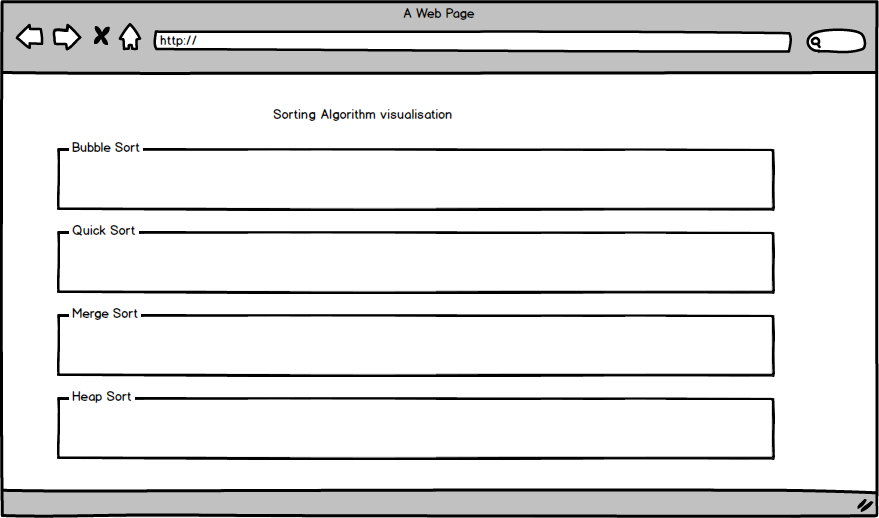

# Sorting-Algorithm-visualization
### Wireframe

### MVP  

Sorting Algorithm visualization will allow users to:

- [ ] visualize different sorting algorithms
- [ ] compare speed among sorting algorithms

### Architecture and Technologies

This project will use JavaScript and `HTML5 Canvas` to implement the visualization of sorting algorithms

## Project Timeline

### Phase 1: quick sort and bubble sort (1.5 days)

- [ ] Create project
- [ ] Set up Project with webpack
- [ ] Write Sticks class that stores its display slope and position
- [ ] Add a button to trigger bubble sort and quick sort visualization

### Phase 2: Merge sort and Heap sort (1.5 days)

- [ ] Write merge sort and heap sort visualization
- [ ] Add a timer on each sorting algorithm

### Bonus Features
- [ ] Add Selection sort and Insertion sort
- [ ] Add odd-even sort and Cocktail sort
- [ ] Add Bitonic mergesort and intrsort
