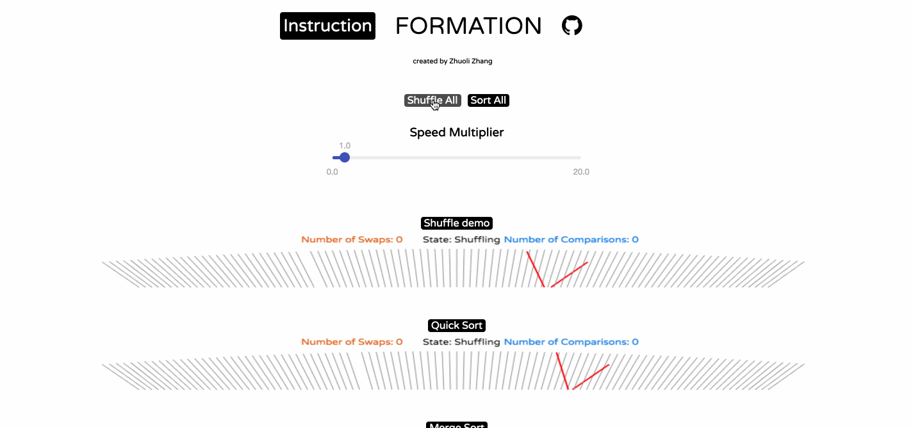

# Formation


[Live](http://www.zhuolizhang.com/formation/)

### Overview

Formation is an interactive Sorting Algorithm Visualization tool built using **TypeScript**, **React**, and **HTML5 Canvas**. It visualizes how different sorting algorithms operate by animating the comparison and swapping of elements (represented as lines sorted by slope).

Supported algorithms include:

- Quick Sort
- Merge Sort
- Bubble Sort
- Insertion Sort
- Selection Sort
- Heap Sort
- Bitonic Sort
- Cocktail Sort
- Odd-Even Sort

### New Feature: Custom Sort Editor

Formation now includes a **Custom Sort Editor**, allowing you to write and visualize your own sorting algorithms in real-time!

- **Monaco Editor**: A full-featured code editor (powered by VS Code) right in the browser.
- **Simplified API**: Write standard JavaScript sorting logic. The application automatically detects comparisons and swaps using a `MagicArray` proxy.
- **Live Visualization**: Run your code and watch it sort the sticks instantly.
- **Speed Control**: Adjust the visualization speed directly from the editor.

### Instructions

1.  **Shuffle**: Click "Shuffle All" to randomize the arrays.
2.  **Sort**: Click "Sort All" to run all algorithms simultaneously, or click a specific algorithm's name to run just that one.
3.  **Custom Sort**: Click the "Custom Sort" button in the header to open the code editor.
    - Write your algorithm in the editor.
    - Use standard array access (`arr[i].pos`) to compare.
    - Swap elements (`[arr[i], arr[j]] = [arr[j], arr[i]]`) to visualize swaps.
    - Click "Update & Run" to see your algorithm in action.
4.  **Speed**: Use the speed multiplier slider to speed up or slow down the visualizations.

### Development

This project has been fully migrated to **TypeScript**.

#### Installation

```bash
npm install
```

#### Build

To build the project for production:

```bash
npm run build
```

#### Test

To run the test suite (including new tests for the Custom Sort feature):

```bash
npm test
```

### Implementation Details

The core visualization engine uses a "Trace" system. Algorithms generate a list of operations (comparisons and swaps), which are then played back by the visualization engine.

For the **Custom Sort** feature, we implemented a `MagicArray` using JavaScript Proxies. This allows the user to write synchronous, imperative code while the system transparently records every read and write operation to generate the animation traces. :p

```typescript
// Example of the simplified Custom Sort API
(arr) => {
  for (let i = 0; i < arr.length - 1; i++) {
    for (let j = 0; j < arr.length - i - 1; j++) {
      // Accessing .pos automatically records a "compare" trace
      if (arr[j].pos > arr[j + 1].pos) {
        // Swapping elements automatically records a "swap" trace
        let temp = arr[j];
        arr[j] = arr[j + 1];
        arr[j + 1] = temp;
      }
    }
  }
};
```
